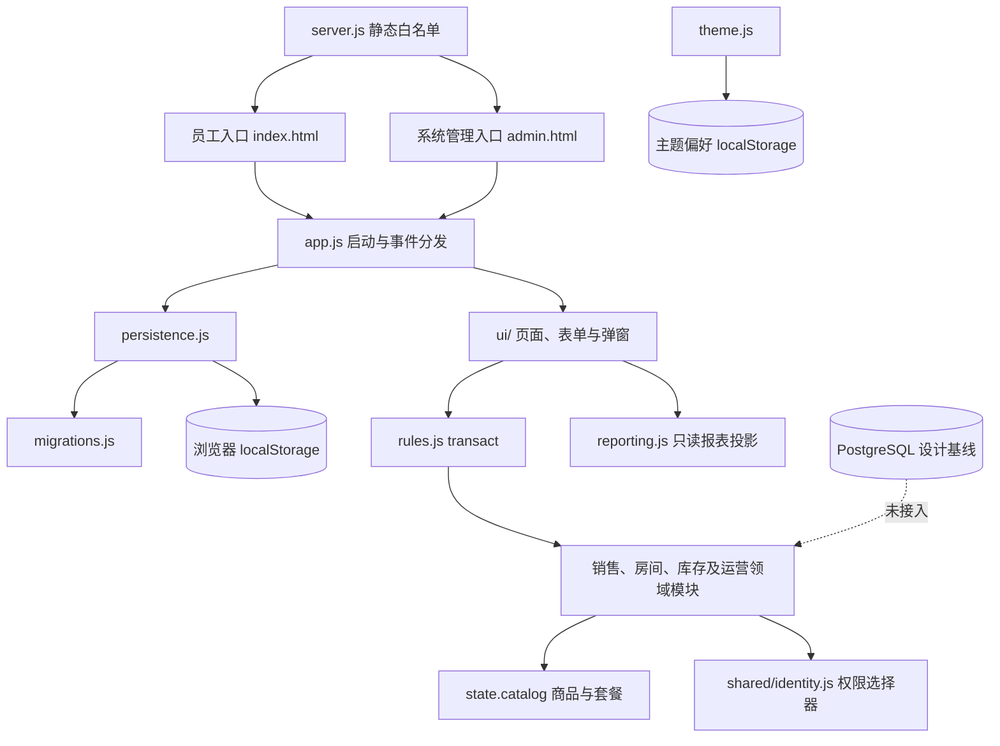

# 系统架构

本文件描述已集成的 Track A＋B 单机演示运行边界，以及尚未接入客户端的 P0-1 Stage 1A 账本协议。具体入口见 [MODULE_MAP](./MODULE_MAP.md)，验证结果见 [CURRENT_STAGE](./CURRENT_STAGE.md)。

## 系统边界

所有营业事实与权限仍由单浏览器状态持有。演示身份可切换；页面权限校验不能视作真实认证或服务端授权。`server.js` 只供应静态文件，不提供业务 API。

## 模块与依赖

- `app.js` 负责入口判断、持久化装配和浏览器事件分发。`ui/context.js` 持有页面上下文，`ui/shell.js` 在保存成功后才替换当前状态并渲染；`ui/pages/`、`ui/dialogs/` 和 `ui/forms.js` 负责展示与输入。
- `rules.js` 的 `transact` 克隆原状态、校验操作键和目录价格，再调领域命令；失败不返回新状态。它仍保留身份、目录、赠酒和部分订单事务分支。页面隐藏不代替领域权限检查。
- `sales.js` 负责销售行、收款、免零、挂账、回款及金额选择器。`rooms.js` 负责报价、开房、房态、预约和房间异常；结账及挂账后的房间释放由两域通过 `transact` 协调。`inventory.js` 负责期初、盘点、审核与库存流水。
- `catalog.js` 管商品目录、销售规格、套餐查询和价格一致性校验；`packages.js` 构造默认套餐。运行时以 `state.catalog` 为唯一当前目录，`DEFAULT_CATALOG` 只供初始化与迁移。报价、更新事务及加载路径会拒绝价格不等于基础房费加赠饮参考值的套餐。
- `deposits.js`、`expenses.js`、`procurement.js`、`incidents.js`、`handover.js` 拥有各自业务记录；`reviewInbox.js` 只读汇总审核待办与历史。挂账和大额报销审核同时检查具体权限、指定岗位及本人审核附加权限，已授权自审留标记。
- `reporting.js` 以状态快照生成日、周、月报表选择器和视图模型，`ui/pages/reports.js` 仅渲染。销售历史名称、分类、数量和成交额优先读订单快照；未知旧值不以当前目录补造。
- `shared/identity.js`、`shared/money.js`、`shared/time.js` 提供身份、整数分与演示时段基础。`theme.js` 与业务状态使用不同存储键。

## 数据流与失败边界

1. `persistence.js` 从 `jbhh-demo-v1` 读取原文，`migrations.js` 校验结构、套餐价格并补齐旧字段。已知历史成交金额保留；缺少旧名称或价格时标未知。
2. 原文损坏或旧套餐金额不一致时，`persistence.js` 保留原 key，并在不覆盖已有不同备份的前提下尝试复制到 `jbhh-demo-v1-recovery`。所有异常加载都停写；可解析的旧记录只在内存迁移供历史订单和付款核对，页面进入只读核对页，可展开查看并复制原文。备份成功也不解除停写；人工修正主记录并点击“重新检查本机记录”通过完整校验后才恢复保存。迁移不按当前目录重算历史成交金额。
3. 页面把输入交给 `transact`。房间和无房零售共用 `orders`；`retail.room` 为 `null`。房间增购和零售共用销售规格与基础库存数量校验；未建账或余额不足时整笔不提交。
4. `ui/shell.js` 调用 `persistence.save`，成功后才替换页面状态。挂账驳回时原申请及决定进入订单的 `creditHistory`，原房间不被重新占用；游离旧单的完整处置流程尚未实现。
5. 主题偏好使用 `jbhh-appearance-v1`，不随业务练习状态重置。

这仍是单机快照事务，没有服务端并发控制、可靠备份或真实资金事件。跨设备、正式支付、退款、撤单、冲正、营业日、班次和渠道对账须另行实现，目标见 [脱岗 P0 契约](./OFFSITE_CONTRACTS.md)。

## P0-1 Stage 1A 账本核心事务协议（独立 Node 入口）

`ledger/application.js:createLedgerApplication` 接收 `{operationKey, expectedRevision, action, payload}`，按 JSON 值规范化请求内容并计算 SHA-256 指纹（包括 `expectedRevision`、动作和业务输入）。它在存储适配器的 `runAtomic` 边界内先查询该操作键的已提交结果，再比较当前 revision；同键同指纹返回原成功回执，同键不同指纹返回 `idempotency-conflict`，新键旧版本返回 `revision-conflict`。冲突不自动生成新键，也不调用领域事务。

首次有效命令沿用未修改的 `rules.js:transact`。仅在领域事务成功、原有 `state.processed` 操作键可核对后，才提出一次 `revision + 1` 的提交。存储适配器必须把业务状态、该操作键的成功回执和 `command.succeeded` 审计作为**同一事务**持久化；失败不得出现三者中任意一项的部分提交。回执含原 revision、新 revision、请求指纹和提交时间。已有 `processed` 键却没有可信回执时保守返回冲突，不伪造成功。成功审计只记录动作、操作键、指纹、版本和时间，不把 payload 复制进第二份业务事实；真人身份须在后续认证阶段由可信服务端绑定。

`ledger/memory-store.js:createMemoryLedgerStore` 通过单实例串行队列实现上述 `runAtomic` 端口并用于契约测试，隔离读取副本，在一次赋值中公开状态、回执、revision 和审计。它**不是**跨进程共享或断电可恢复的账本。未来正式存储适配器必须在同一数据库事务中锁定／比较账本版本、保证操作键唯一，并在提交前保存全部三项；遇到并发冲突时返回新版本供调用方刷新判断。当前 UI、`persistence.js`、`migrations.js`、PostgreSQL 设计基线及报表均未连接此协议。

## 状态所有权

| 事实 | 当前 owner | 持久化 |
|---|---|---|
| 当前商品、规格、套餐 | `state.catalog`；`catalog.js` 查询，`rules.js` 维护 | `persistence.js` 的完整状态快照 |
| 房间、预约、异常 | `rooms.js` | 同上 |
| 订单、销售快照、付款、挂账与回款 | `sales.js`；`rules.js` 协调跨域 | 同上 |
| 库存余额、期初及流水 | `inventory.js` | 同上 |
| 支出、采购、客诉、存取酒、交班 | 对应领域模块 | 同上 |
| 权限配置 | `shared/identity.js` 定义，状态中 `capabilities` 保存覆盖 | 同上；不是真实认证 |
| 报表 | `reporting.js` 只读派生 | 不单独存第二份事实 |
| PostgreSQL | `database/` 设计基线 | 当前运行时未接入 |

`database/schema.sql` 的 `room_orders.room_id` 仍要求非空，不能直接承载当前无房零售。正式系统需要受信任的 API、真实身份、服务端事务、审计、并发版本、支付与退款证据、可验证备份及数据库迁移。