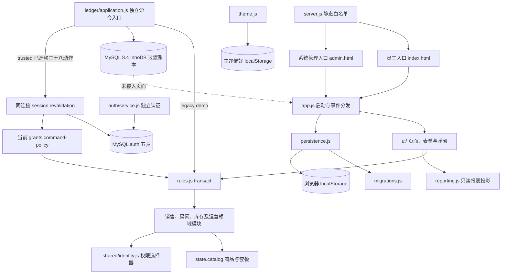

## Stage 5D operational boundary

Existing safe logger → bounded rotating file/stderr. Runtime reads confirmed sources → independent atomic incident/outbox file → asynchronous bounded transport → permission-filtered admin summary. Business/auth transactions never await alert sends. Incident state is protected Git-external operational telemetry, not a second ledger or MySQL schema authority. One writer per dedicated directory, recovery-first UNKNOWN behavior unchanged, no automatic remediation. [Contract](STAGE5D_MONITORING_RUNBOOK.md).

## Stage 5C runtime boundary

Windows service -> explicit production entry -> direct TLS -> existing authenticated HTTP/trusted application/MySQL. External protected config/secrets and safe logs; health/readiness/worker/drain belong to runtime, not domain. No proxy trust, direct remote DB access or production migration at startup. [Contract](STAGE5C_DEPLOYMENT_RUNTIME.md).

## Stage 5B recovery boundary

MySQL remains the sole business authority. Recovery control/event tables coordinate HTTP writes, guarded SQL transactions and provider dispatch; they are not a second ledger. Verified artifacts restore exact values into a separate TEST database and remain VERIFYING until invariant checks/session invalidation/workflow fencing, then require explicit resume and target application restart. Backup is an online consistent readonly snapshot. [Contract](STAGE5B_BACKUP_RECOVERY.md).

## Stage 5B

Stage 5B preserves existing MySQL business/auth/workflow facts in one consistent logical snapshot; restore never replays business commands to rebuild history. Recovery operational state is separate from the ledger revision.

## Stage 4C opening integration

The current integration supersedes historical no-employee-wiring notes below: ledger/application.js enrolls through devices/mysql-port.js on the same ledger connection; devices/runtime.js composes the existing workflow with a bounded persistent worker. Snapshot reads combine business and workflow facts before server-side projection. Provider I/O stays outside SQL transactions and the real adapter remains disabled. See [contract](STAGE4C_OPEN_DEVICE.md).

## Stage 4B provider transport boundary

devices/ktvsky-http-client.js owns bounded server-side HTTP with TLS verification, no redirects or retries. devices/ktvsky-gateway.js owns provider credentials, private token/Cookie cache, observed response mapping and conservative UNKNOWN results. productionEnabled remains false; there is no employee open, HTTP registry or bootstrap connection. Raw provider evidence alone does not establish settled operations or a verified countdown end time. The isolated validation boundary combines persisted ACK, dispatch/observation times and bounded remaining-seconds evidence to confirm its own open step, preserving that historical observation after expiry. It does not enable production workflow control. The isolated validation tool applies a branded three-factor policy and a flushed exclusive external UNKNOWN journal before control; restart and concurrent processes can only query a claimed device. It does not change the MySQL business/schema authority or expose a new employee/API path. See [Stage 4B contract](STAGE4B_KTVSKY_ADAPTER.md).

## Stage 4A independent device boundary

Server session/price facts remain in the existing ledger snapshot. devices/application.js holds a separate durable room-control workflow using devices/mysql-store.js and migration 008, with claim/effect/evidence phases and no external call inside a DB transaction. No HTTP registry entry or employee open wiring exists yet. See [contract](STAGE4A_SESSION_DEVICE.md) and [provider discovery](KTVSKY_CAPABILITY_DISCOVERY.md).

## Stage 3C 管理后台正式读取路径（2026-10-08）

`/admin` 由 `admin.html` 和 `ui/admin-app.js` 启动，不加载演示 `app.js`。页面沿用 `ui/api-client.js` 与 `ui/server-state.js`：先读取正式 `GET /api/v1/auth/session`，再读取 `GET /api/v1/admin/snapshot`。后者在 `http/api.js` 复用 `sessionReader.withContext` 的同连接事务内重验和账本读取，`http/admin-query.js:projectAdminSnapshot` 要求当前 `backend.view`，按具体权限及 policy attributes 将房态、订单基本状态、费用、采购、异常和审核队列逐字段裁剪。浏览器只收到已裁剪视图及 ledger revision；撤权后新查询立即拒绝。断网保留最后确认的只读视图，未认证与无后台资格分别显示登录或拒绝页。

第二提交在 `ui/admin-app.js` 复用 `ui/command-flow.js` 与 `ui/pending-command-journal.js`，从服务端审核队列选择事项，经 `ui/admin-approval.js` 的显式映射送至既有 `POST /api/v1/commands/:action`。首次发送前保存原 operationKey、最后确认的 revision 与最小 payload；结果不明时原账号按原键重试，换账号禁止重试。服务端 command registry、事务内认证及审批策略继续决定结果；成功后重新读取 session/admin snapshot，revision 冲突只刷新而不自动审批。队列的 canDecide 由服务端复用 `authorizeReviewCommand` 计算，本人审批及特殊免零属性不由浏览器角色推断。

## Stage 3B 员工入口运行数据流（2026-10-06）

/ 由 ui/staff-app.js 装配：同源 HTTP auth/session → HttpOnly Cookie → 服务端当前 session 与权限 → GET /api/v1/store/snapshot → 按当前 principal 过滤的页面投影和正式 ledger revision。页面模块只消费投影；本地旧演示状态不参与正式入口。写入由 ui/command-flow.js 发 POST /api/v1/commands/:action，带 CSRF、原始操作键及已确认 revision；HTTP registry、事务内认证复查、授权、幂等、领域变更与 MySQL 提交仍是 Stage 3A/可信核心路径。服务端写入结果后再次读取 session/snapshot；不以浏览器计算替代已确认状态。/admin 的演示路径与正式员工入口分离。

### 平台券领域与外部副作用边界（R.1）

## trusted open 与平台绑定

ledger/voucher-opening.js 在 auth／existing terminal／新授权／revision／employee／business-day snapshot 后，验证仅内部 redemption ID 并使用同 connection voucher binding。vouchers/binding.js 的 transaction-bound port 不 BEGIN/COMMIT/ROLLBACK/release；先锁且检验 REDEEMED 当前门店未绑定记录，返回冻结证据和显式套餐映射，领域成功后才写 linkedOrderId/version。无映射 fail closed；不能通过产品名、旧 role 或 payload 补全。

createMySqlLedgerStore 的可选 bindVoucherRedemptions 仅绑定当前 connection，不借第二个连接。固定顺序 head→auth→employee→voucher→domain state/link→head/operation/audit；同一 ledger 的 voucher orchestration/event 也先 head，不能倒序 voucher→head。本地业务提交失败完整回滚 link；已成功的 provider fact 属于更早独立事务，开房失败不会抹去或重新 consume。事件对已绑定券逆向只产生异常，不修改历史订单。

rooms.js:openRoom 显式 demo/trusted，可信 actor 与 attributed employee 分开；shared/identity.js 的 withTrustedRoomOpening 仅接受内部冻结证据与服务器新订单 UUID。snapshot 仍保留原套餐／商品／基础数量逻辑；只在真实证据与当前套餐匹配时覆盖房费。quote 不接浏览器 evidence、不把待验券计作覆盖。trusted 使用显式 store zone 判断原 14-18／18-02 时段并冻结 noon-v1，demo 保留原设备时间。历史数据不自动迁移。

vouchers/application.js 是独立 orchestration，使用 vouchers/domain.js 的集中状态转换与 PlatformVoucherGateway DTO；领域不接触美团原始 JSON。vouchers/gateway.js 定义四方法 port 和显式 DTO mapping boundary；vouchers/gateways.js 的 MeituanSkillGateway 只保留 config／credential／transport／mapping seam，所有真实方法均拒绝，Meituan production redemption = NOT ENABLED。没有网络或 mt-tech 调用。FakePlatformVoucherGateway 有可观察调用次数，并要求显式 test mode 与隔离 test store。

vouchers/mysql-store.js 的 runAtomic 只运行本地数据库工作：同一 connection BEGIN、锁 ledger head、同连接 session 重验、voucher operation／redemption、COMMIT/release。认领 A 提交后才 inspect/consume；证据 B 另开短事务。调用方不得把 provider promise 放进 createTrustedLedgerApplication/transact。认领成功后重试读取本地 receipt；UNKNOWN 终态不可重写，独立 query key 更新 redemption。A 或 B COMMIT 结果不明时抛出专门 outcome-unknown，不把数据库断连伪装成 provider FAILED。A 失败完整回滚；B 失败保留已认领 attempt，后续 query 收敛，不能撤销已发生的外部效果。

外部 attempt 的 voucher_operations 使用独立 voucher command receipt 空间（ledger_id＋operation_key），Stage 1 ledger_operations 的 action/fingerprint/revision/terminal 协议保留。claim/query 不改变业务 snapshot 或 ledger revision；真正开房才通过 ledger transaction 提交 snapshot/revision/audit。新 key 先认证再查旧 receipt，仅无旧 receipt 才用当前 room.open permission；旧 key 仍要求有效原 actor session。暂不新增核销 permission，真实启用前的最终权限配置仍待确认。

receiveProviderEvent 只接受内部 verified provider capability；本阶段没有 HTTP webhook 或验签入口。事件先保存 canonical business message ID／envelope ID／payload hash，重复返回旧结果；不能明确关联或非法状态转换的事件保存 reconciliation-required，关联记录产生 voucher_exception。订单已绑定时的 REVERSED/REFUNDED 只改 provider fact 并产生待办，不改业务 snapshot。尚未匹配的事件留待后续可信 reconciliation，不猜业务记录。

state snapshot 仍是过渡账本模型；新增 provider 元数据不代表完成领域关系化、localStorage 导入或美团上线。

 系统架构

本文件描述已集成的 Track A＋B 单机演示运行边界，以及尚未接入客户端的 P0-1 账本、Stage 2A 命令策略、Stage 2B 认证基础和 Stage 2C.1 同连接重验、2C.2 clean 与 2C.3 房间异常／目录维护／取消预约／存取酒、预约、销售、配品／其他消费及换酒小批的可信执行能力。具体入口见 [MODULE_MAP](./MODULE_MAP.md)，验证结果见 [CURRENT_STAGE](./CURRENT_STAGE.md)。

## 营业日 12:00 规则边界

shared/business-day.js:businessDateFor(occurredAt, {timeZone}) 是独立纯计算规则，BUSINESS_DAY_POLICY 标明 noon-v1／12:00。时间必须是带显式 offset 的有效 ISO 时间戳，门店时区必须显式提供；缺失／无效值直接失败，不使用设备默认时区、state.clock 或 order.time 猜测未知历史。当地 12:00 前归前一日，12:00:00 起归当天；只返回日期，不改写源时间戳。

K05 只扩展过渡 snapshot：ledger/application.js 在 session revalidation、旧 operation lookup、当前授权／revision 与 employee resolver 之后，为新的 retailSale 使用 dbNow 和显式 businessTimeZone 构造 orderBusinessDaySnapshot；branded trusted context 携带该不可变快照，sales.js 创建订单时保存。重放不重算日期。trusted open 现同样复用工厂保存冻结日期，并通过显式 store zone 判原营业时段；不回填历史日期。真实门店时区和历史处置仍见 OPEN_BUSINESS_DECISIONS；测试中的 Asia/Shanghai 仅是显式 synthetic 配置。

## K04 trusted 连续交班

rules.js:transact 在 demo 身份／时钟求值前，委托 handover.js:submitHandover 的显式 trusted 模式；只增加 handover 到已迁移集合，open 保持关闭。沿用现有 ledger head → 同连接 auth → 旧 operation → 新 key 当前权限／revision → domain → 原子提交，application、MySQL adapter/schema 和 Stage 1 协议不改。

首条 trusted 交班是实点 bootstrap，旧 demo 记录只保留显示。后续通过 cashBoundary 的累计 canonical payment ID／不可变事实签名做集合差，不按时间比较或 businessDate 划班；同微秒的付款也恰好消费一次。新状态保存有版本标记的 handoverId／previousHandoverId 链及 actualCash 基线。仅 method=现金的可信付款增加抽屉现金；其他渠道只统计。存取酒无资金效果，expense／procurement 没有抽屉资金来源事实，不作出流。旧不明付款仅在 bootstrap 吸收为边界，不伪造时间；新不明付款或旧边界删改则拒绝计算。现金出流来源、登记和接班签收仍 OPEN，这不是完整排班或事件溯源模型。

## K05 报表边界

reporting.js:selectRevenueOrders 只读冻结 businessDate；selectPaymentFlows 遍历全部 root payments，独立按明确带 offset 的真实时间区间选择，保留微秒边界。正式 reportViewModel 要求显式日期区间与 paymentInterval，返回独立 cashFlow／revenueAmbiguities；legacy 无冻结日期或无可信付款时间产生 ambiguity，完整性标记为 false，绝不据当前 cutoff／order.time／旧练习 time 猜值。原自然日演示接口隔离保留，缺少正式查询不能为冻结订单回退。域选择器不依赖 HTTP、UI 或机器时区，无新表和迁移。

## trusted settle／免零决定

rules.js 的显式 trusted 分支调用 sales.js:settleOrder／decideRounding，只有本批三项增加到 TRUSTED_ENABLED_ACTIONS。settle 使用同一 paymentExecution／appendPaymentRecords；待审 review 保存 session submittedByPrincipalId 与 dbNow。decideRounding 从锁定 state 读取申请 principal 和实际免零差额，不接受 payload 自审、身份、岗位或属性；需 rounding.approve＋本人 review.self，仅超额本人批准再查 configured DB rounding.self.excess。缺可信 principal／分值不明确时 authorization-denied，不写 terminal；决定记录 decidedByPrincipalId 和 dbNow。新 key 的当前资格检查先于“已处理”状态的业务终态，避免撤销属性后由业务拒绝占键；旧 key 仍先返回已持久化原终态。

普通 ≤1000 分无 review 并直接生效；>1000 分以及显式特殊情况待审。K01／K06 修复后，sales.js:settleOrder 返回是否释放房间，待审只记真实 payment 和 review，不关闭订单；decideRounding 批准后通过 closeSettledOrder 以 outstanding=0 判断关单，rules.js 同一 transact 调用 rooms.js:release，驳回不改订单／房态或付款。sales.js:effectiveRoundingCents 只计算已确认直免及金额一致的已批准 review，outstanding 扣除其总额并不小于零。后续 pay／settle 的 preserveRounding 将被替换的当前免零快照追加到可选 roundingHistory，历史状态不推断，pending／rejected／不明记录不抵扣。仅扩展 snapshot，不新增表或第二套资金事实，不修改 reporting／businessDate。有效原 actor 重放先返回旧终态，再谈新 key 当前授权，权限／属性撤销不改写已提交的决定。未知／SQL 故障整体回滚。

## trusted collect／pay／settle 新付款事实

ledger/application 的 session→既有 operation→新 key 授权／revision 顺序及 mysql-store 原子提交未改。collect／pay 已迁移，settle 本批复用同一付款路径；rules.js 显式 trusted 分派不进入 demo identity／clock 分支，sales.js 的 paymentExecution 只消费 branded context。原校验成功后 appendPaymentRecords 在服务端执行中使用 Node 内置 crypto.randomUUID，查本账本保留的付款 ID，碰撞作为未知错误回滚，绝不接受客户端 paymentId。每笔新 payment 保存 paymentId、occurredAt=context.dbNow、recordedByPrincipalId=context.principalId；person 为 actorSnapshot 的显示名或 null，time 为同一 DB 时间兼容字段。字段仅向后兼容追加，不补造旧付款。

请求重试先读已存 operation，故不重新执行 UUID 生成或付款、结账、房态变化；未知／SQL 故障不留 payment、revision、operation 或 audit，故障修复后原 key 可重试。collect 仍收足单个当前 charge 并保持营业；pay 仍全额结清且无免零。正式 reporting 双口径见本节补充：settle／rounding 审核见上节；open 仍正式拒绝；handover 的后续 trusted 迁移见下节。不增加生产依赖、表或客户端入口。

## 系统边界

当前演示的营业事实和演示权限仍由单浏览器状态持有。演示身份可切换；页面权限校验不能视作真实认证或服务端授权。`server.js` 只供应静态文件，不提供业务 API。

## 模块与依赖

- `app.js` 负责入口判断、持久化装配和浏览器事件分发。`ui/context.js` 持有页面上下文，`ui/shell.js` 在保存成功后才替换当前状态并渲染；`ui/pages/`、`ui/dialogs/` 和 `ui/forms.js` 负责展示与输入。
- `rules.js` 的 `transact` 克隆原状态、校验操作键和目录价格，再调领域命令；失败不返回新状态。它仍保留身份、目录、赠酒和部分订单事务分支。页面隐藏不代替领域权限检查。
- `sales.js` 负责销售行、收款、免零、挂账、回款及金额选择器。`rooms.js` 负责报价、开房、房态、预约和房间异常；结账及挂账后的房间释放由两域通过 `transact` 协调。`inventory.js` 负责期初、盘点、审核与库存流水。
- `catalog.js` 管商品目录、销售规格、套餐查询和价格一致性校验；`packages.js` 构造默认套餐。运行时以 `state.catalog` 为唯一当前目录，`DEFAULT_CATALOG` 只供初始化与迁移。报价、更新事务及加载路径会拒绝价格不等于基础房费加赠饮参考值的套餐。
- `deposits.js`、`expenses.js`、`procurement.js`、`incidents.js`、`handover.js` 拥有各自业务记录；`reviewInbox.js` 只读汇总审核待办与历史。挂账和大额报销审核同时检查具体权限、指定岗位及本人审核附加权限，已授权自审留标记。
- `reporting.js` 以状态快照生成日、周、月报表选择器和视图模型，`ui/pages/reports.js` 仅渲染。销售历史名称、分类、数量和成交额优先读订单快照；未知旧值不以当前目录补造。
- `shared/identity.js`、`shared/money.js`、`shared/time.js` 提供身份、整数分与演示时段基础。`theme.js` 与业务状态使用不同存储键。

## 数据流与失败边界

1. `persistence.js` 从 `jbhh-demo-v1` 读取原文，`migrations.js` 校验结构、套餐价格并补齐旧字段。已知历史成交金额保留；缺少旧名称或价格时标未知。
2. 原文损坏或旧套餐金额不一致时，`persistence.js` 保留原 key，并在不覆盖已有不同备份的前提下尝试复制到 `jbhh-demo-v1-recovery`。所有异常加载都停写；可解析的旧记录只在内存迁移供历史订单和付款核对，页面进入只读核对页，可展开查看并复制原文。备份成功也不解除停写；人工修正主记录并点击“重新检查本机记录”通过完整校验后才恢复保存。迁移不按当前目录重算历史成交金额。
3. 页面把输入交给 `transact`。房间和无房零售共用 `orders`；`retail.room` 为 `null`。房间增购和零售共用销售规格与基础库存数量校验；未建账或余额不足时整笔不提交。
4. `ui/shell.js` 调用 `persistence.save`，成功后才替换页面状态。挂账驳回时原申请及决定进入订单的 `creditHistory`，原房间不被重新占用；游离旧单的完整处置流程尚未实现。
5. 主题偏好使用 `jbhh-appearance-v1`，不随业务练习状态重置。

这仍是单机快照事务，没有服务端并发控制、可靠备份或真实资金事件。跨设备、正式支付、退款、撤单、冲正、营业日、班次和渠道对账须另行实现，目标见 [脱岗 P0 契约](./OFFSITE_CONTRACTS.md)。

## P0-1 Stage 1A 账本核心事务协议（独立 Node 入口）

`ledger/application.js:createLedgerApplication` 从可信调用方显式接收 `principal.id`，从适配器取得 `ledgerId`；业务命令只含 `{operationKey, expectedRevision, action, payload}`，额外传输字段不进入命令。按 JSON 值规范化动作、期望版本和业务输入并计算 SHA-256 指纹，属性插入顺序不影响结果。`runAtomic` 内先按该 ledger 的操作键查终态，再核对 actor 与指纹：同 actor／同请求返回原终态，不同 actor 或改了动作、版本、payload 返回 `idempotency-conflict`，不得泄露原回执。

新键若 `expectedRevision` 已过期，原子记录 `revision-conflict` 终态；现有领域规则显式抛出 `BusinessRejection` 时，原子记录 `business-rejected` 终态。两者均不改变业务 state、revision 或成功审计。刷新后要重新判断并发起业务动作，必须使用新操作键，付款不能用旧键改写版本后重提。首次有效命令仍调用 `rules.js:transact`，业务判断与提示保持原样；成功时状态、含 actor 的成功回执、`command.succeeded` 审计和递增一次的 revision 同事务提交。已存在 `state.processed` 键却没有可信回执时停在冲突，不伪造结果。其他普通 `Error`、程序错误和存储错误均向外传播并回滚，不占用操作键；故障修复后可用原键重试。错误分类不根据文案猜测。此段描述保留的 Stage 1 legacy／demo 入口，actor 是注入的测试值；session-derived trusted 入口见下方 2C.2／2C.3。

`ledger/memory-store.js:createMemoryLedgerStore` 通过单实例串行队列实现 `runAtomic` 的 `read`、`findOperationResult`、成功 `commit` 和拒绝 `recordTerminal`；每笔操作只公开一个终态。它**不是**跨进程共享或断电可恢复的账本。Stage 1B-MySQL 适配器已按同一端口在数据库事务中锁定账本版本，并把成功时的 state／revision／终态结果／审计一起提交；真实 MySQL 集成证据见 [CURRENT_STAGE](./CURRENT_STAGE.md)。当前 UI、`persistence.js`、`migrations.js` 及报表均未连接此协议。

## P0-1 Stage 1B-MySQL 过渡账本（独立 Node 入口）

`ledger/mysql-store.js:createMySqlLedgerStore` 实现冻结的 `runAtomic` 端口；调用方显式提供 `mysql2` promise Pool、ledgerId 与已迁移的 MySQL 数据库名。每条命令只借用一个 connection，在 `START TRANSACTION` 后按主键 `SELECT ledger_heads ... FOR UPDATE`，向 application 提供同键终态查询、可选的同连接认证与 employee resolver 能力，再由显式 execution mode 决定执行顺序。成功时将 MySQL JSON state、revision、语义快照校验和、operation result 和成功审计同事务提交；旧 revision 或明确业务拒绝只保存终态 operation。未知异常和 SQL 写入失败回滚，提交结果不明时保留原 key 供查询，不自动生成新 key。成功时间由数据库 `UTC_TIMESTAMP(6)` 生成，未知或损坏快照停写。

`database/migrations/001_mysql_ledger_core.sql` 的三表均为 InnoDB，并以主键、唯一约束及外键保护操作与审计。MySQL JSON 规范化后的快照校验和只验证状态 JSON 值；它不是原始 localStorage 文本备份，未来正式导入必须另留原文及原文 SHA-256。此为单门店版本化 snapshot 过渡模型，最终领域关系模型尚未完成。真实 MySQL 8.4.11／InnoDB 的 migration、行锁竞争、重连持久性和回滚证据见 [CURRENT_STAGE](./CURRENT_STAGE.md)；适配器未接入浏览器或 HTTP；独立 Node trusted 入口仅对已迁移的三十八个房间／目录／存取酒／预约／销售／配品与其他消费／换酒／房间恢复审核／库存申请／审核、赠酒提交／审批及 expense 申请／审批及 credit 申请／决定、repay 申请／审批与 incident 创建／处理／恢复审核和采购动作使用 session 身份，具体集合见下文。

当前唯一 schema authority 是 `database/migrations/` 的 versioned MySQL migrations（001..007），含 InnoDB 过渡 JSON ledger 与 auth/employee/voucher 元数据；JSON orders 保留 room/retail 判别，retail.room=null，不靠虚拟房间。SQL 执行与重复/部分失败边界以 [数据库说明](../database/README.md) 为准。

旧 `database/schema.sql`、`seed.sql` 均标明 LEGACY / NOT USED FOR CURRENT MYSQL，当前运行/部署不执行它们；`database.test.js` 只以 MySQL 为当前结构权威，旧文件仅保全历史完整性。它们和 `codex/p0-1-trusted-ledger@7d3c23c` PostgreSQL 适配器只保留历史设计／实验参考。PostgreSQL 实验未取得真实数据库验收，也未推送或部署；它不是当前正式数据库方向。

## P0-1 Stage 2A 可信命令策略（已迁移三十八动作接入）

`ledger/command-policy.js` 位于服务端 ledger/application 邻近边界，但不改变 `createLedgerApplication`、`runAtomic` 或领域事务。它仅以显式注入且经工厂隔离的可信 principal 判断 action 是否在 45 个现有非演示命令清单内，以及该动作的具体权限资格；未知与演示专用动作默认拒绝。它不读取 MySQL、房态、库存、付款或审批状态，也不计算金额。允许结果始终标明下一阶段须在账本锁内重验当前账号／权限和业务相关事实，不是一次可提交授权。

`trustedExecutionContext.actualActorPrincipalId` 只取自注入 principal；`attribution.creditedEmployeeId` 只是客户端请求的业务归属候选，尚未核实员工名册，不能替代操作者或授予权限；reserve／sale／retailSale 的候选现由下述事务内 resolver 核实。已迁移审核已从锁定账本读取本次申请人的真实 principal ID，其他审核动作须在后续迁移后，再同时检查具体审核权限和 `review.self`；超额免零本人审核还需显式 `rounding.self.excess` 授权属性。当前没有真人账号映射，不能按姓名或历史演示 ID 赋权。浏览器 DEMO 路径继续保留原规则。clean、房间异常提交、目录维护三动作、取消预约、存取酒、预约、销售、配品／其他消费、换酒、房间恢复审核、库存申请／审核、gift 提交／审批及 expense 申请／审批及 credit 申请／决定、repay 申请／审批、incident 创建／resolveIncident／两项恢复审核在 ledger transaction 中调用该策略；其他 8 个 eligible action 尚未获 trusted execution enablement，2D 未接入。

## P0-1 Stage 2B 认证基础（独立 Node 入口）

`auth/service.js:createAuthService` 编排合成账号创建、登录、会话认证、退出、撤销、停用、凭据轮换和具体权限变更；`auth/mysql-store.js:createMySqlAuthStore` 将关联写入放在同一 MySQL connection／事务。`auth/password.js` 用 Node 内置异步 scrypt 和每条凭据独立随机 salt；`auth/session-token.js` 产生 256-bit 随机 token，数据库只存 SHA-256 digest。`auth/rate-limit.js` 是显式注入的登录限流端口的单进程实现，默认阈值为 15 分钟内 5 次失败；多进程正式入口须注入共享实现。没有新增生产依赖。

`auth_accounts` 的随机 UUID principal ID 由服务端生成，模块不提供删除或重用账号的方法；停用保留账号与审计历史。`auth_grants` 只存具体 permission，不存管理员通配捷径。每次认证都在数据库中重新核对账号启用状态、凭据版本、session 撤销与过期状态，并读取当下 grants；session/token 不携带权限。登录成功的 session 和 `login-success` 事件同事务；失败登录、退出、停用与撤销事件使用数据库时间。不存在账号和密码错误对外同为 `invalid-credentials`。独立认证服务不暴露 HTTP 或 UI；已迁移的三十八动作使用 2C.1 同连接重验。账号与权限管理方法仍是可信内部能力，尚未经过 command 授权，不得对客户端暴露。

`database/migrations/002_mysql_auth_core.sql` 的五张 InnoDB 表已在专用 MySQL 测试库中验证；脚本执行一次，重复执行首表报已存在。集成测试只在 URL、实际库名、MySQL 版本与默认引擎均符合条件且包括属性表的六张 auth 表预先不存在时建表，另执行下述 004，再执行 005 → 006 扩展具体属性 CHECK，结束只删除本次建的 auth 表。测试证据见 [CURRENT_STAGE](./CURRENT_STAGE.md)。真人 account ID、登录标识与凭据发放等仍见 [OPEN BUSINESS DECISIONS](./OPEN_BUSINESS_DECISIONS.md)。

## P0-1 policy attributes 基础（独立内部管理能力）

`auth/policy-attributes.js:createPolicyAttributeService({store})` 公开 configurePolicyAttributes({principalId}, {actorPrincipalId})、grantPolicyAttribute／revokePolicyAttribute({principalId, attributeId}, {actorPrincipalId})。第二参数只能由可信内部调用方提供，不能复制请求 JSON；此接口未接 session 管理授权、HTTP 或任何业务 command。当前只接受 rounding.self.excess、expense.approval.boss、credit.approval.manager 和 credit.approval.boss，未知属性／姓名／角色／额外身份字段均拒绝。目标和实际 actor 必须存在且启用；两者按规范 UUID 升序 FOR UPDATE 锁 account，再写配置或属性及审计。多账号顺序与 employee 管理能力一致，独立事务不取得 ledger head。重复变更安全，不产生重复事件；configure 只标记已配置，不清空已有属性；未配置却已有属性行时拒绝 configure，不静默采纳异常属性；未配置时 grant／revoke 明确拒绝。

`004_mysql_auth_policy_attributes.sql` 增加 auth_accounts 的 NOT NULL 默认 0 配置标志、auth_policy_attributes 的 (principal_id, attribute_id) 主键／account FK／数据库 UTC granted_at；auth_events 扩展 actor_principal_id FK 与 policy_attribute_id。新三类事件 policy-attributes-configured／policy-attribute-granted／policy-attribute-revoked 的 principal_id 明确是目标，actor_principal_id 是实际操作者；shape CHECK 强制两者存在，configure 无 attribute ID，grant／revoke 只记录具体属性 ID，不复制集合、凭据、token 或 payload。旧事件的 actual actor 保持 null，不猜历史操作者。事件 occurred_at 继续由数据库生成；配置／属性／事件同连接原子提交，SQL／未知异常全部回滚，COMMIT 不明继续使用现有 AuthCommitOutcomeUnknown 协议。

revalidation 在 account → session → 当前 grants → 当前 attributes 后取一次 DB UTC 时间。标志和集合必须一致，未配置却存在属性、缺失标志、未知属性直接失败；已配置空集合与未配置不同。trusted context 的标志及冻结集合受注册 guard 检查，属性数组与工厂生成 principal 同源；payload／姓名／演示角色不能补全。只读认证不更新 session activity。没有创建真人账号或属性配置。属性基础本身不开放业务动作；当前已迁移集合见下文，rounding 等未列动作仍未迁移；expense 与 credit 决定使用下述明确分级属性，不从 demo 岗位推导。

## P0-1 员工名册基础（独立内部接口）

`employees/service.js:createEmployeeService` 使用数据库无关名册 port，公开 createEmployee、getEmployee、disableEmployee、linkPrincipal、unlinkPrincipal。写方法的第二参数必须显式提供可信内部调用方的 actorPrincipalId；它只用于审计、需存在且账号启用，不从输入姓名、关联对象或演示身份推导。此能力尚未接 session／command 授权入口，不能向客户端直接暴露；不改变 existing command policy、trusted-enabled 或任何业务 action。

`employees/mysql-store.js:createMySqlEmployeeStore` 只操作新 employees／employee_events 和当前 auth_accounts 依赖；每次组合写入借一条连接、BEGIN／COMMIT，SQL／未知异常回滚。先非锁定定位员工旧关联，将 actor／旧 principal／目标 principal 按 UUID 升序锁住 account，再 FOR UPDATE 锁 employee 并复核关联；定位结果变化时拒绝，不在 employee 锁后追加 account 锁。重复同一关联、重复解除或重复停用返回 changed:false，不增加事件；不同目标需先解除，唯一 principal 碰撞明确拒绝。COMMIT 回执不明时销毁连接，错误带 employeeId 供核查，不能自动重新创建。

`database/migrations/003_mysql_employee_core.sql` 新建两个 InnoDB 表，需先执行 auth migration。employees 只含稳定 employee_id、可同名 display_name、enabled、nullable unique principal_id FK、数据库 UTC created_at／updated_at。employee_events 追加 employee-created、employee-disabled、principal-linked、principal-unlinked，保存 actor 与关联前后 ID，event shape／FK 保证引用与事件类型一致；接口不提供硬删除、ID 重用或审计改写。停用员工保留关联且不改 auth；停用账号不自动停用员工。关联管理与事务内归属解析分别提供独立接口，真实员工及账号配置仍未创建，历史 state 的人员快照不改写。

事务内归属解析由 employees/employee-resolver.js:createTransactionBoundEmployeeResolver 定义数据库无关 port；MySQL store 的 bindEmployeeResolver(connection) 绑定调用方已开启的事务，提供 resolveCreditedEmployeeInTransaction({creditedEmployeeId}) → 冻结 {employeeId,displayName}。明确拒绝 pool 参数，先以 DO 0 的事务状态位拒绝非活动事务，并核实目标库；只按 employee_id 做 SELECT employee_id／display_name／enabled ... FOR SHARE 当前读取，不读取 principal 关联、actor、权限或演示数据。不存在／停用分别抛 EMPLOYEE_NOT_FOUND／EMPLOYEE_DISABLED，未知 SQL／port 异常原样传播，仅在已迁移的归属动作中翻译明确员工拒绝为 ledger 业务终态。不会借连接、BEGIN／COMMIT／ROLLBACK／release，也不更新员工、审计或 session 活动。

共享 employee 锁由调用方持有到提交／回滚：解析先取得锁时，disable 的 employee FOR UPDATE 必须等待；disable 先取得锁并提交后，解析看到停用并拒绝，旧 REPEATABLE READ 快照不能代替当前读取。resolver 不追加 account 锁；管理路径继续 account UUID 升序 → employee → event。reserve／sale／retailSale command 先完成 ledger／auth 前序锁、回执查询、授权与 revision 校验，再解析 employee，不在 employee 锁后倒退加 auth 锁；actualActorPrincipalId 仍独立于 creditedEmployeeId，其余 action 未消费 resolver。

## P0-1 Stage 2C.1 同事务认证能力

`auth/session-revalidation.js:revalidateSessionInTransaction({port, tokenDigest})` 是数据库无关的只读认证函数。MySQL 组合入口为 `authStore.bindSessionRevalidation(connection).revalidateSessionInTransaction({tokenDigest})`：只使用显式注入的当前连接，检查已有事务，绝不借新连接、BEGIN／COMMIT／ROLLBACK／release，也不更新 `last_seen_at` 或闲置期限。无效 session 返回 null；SQL／未知异常向调用方传播，由事务所有者回滚。普通 `authenticateSession` 仍管理独立事务并更新活动，不可用来替代此 port。

锁顺序：ledger head → auth account → auth session → grants／policy attributes → 后续 operation／state／audit。token digest 的非锁定定位不构成认证；锁住 account 后锁 session，并重新核对 ID、digest、principal、撤销与凭据版本。grants 使用 `ORDER BY permission_id FOR UPDATE`、属性使用 `ORDER BY attribute_id FOR UPDATE` 当前读；配置标志来自 account 的锁定当前值，避免旧 REPEATABLE READ 快照。auth 独立事务不取 head，统一 account 在前、既存 session 在后，多个 session 按 ID 排序，然后处理 grants／credentials／event；新账号／新 session 在其 account 锁保护下插入。退出及按 session ID 撤销也先定位、再锁 account／session。

锁定上述事实后，单次 `UTC_TIMESTAMP(6)` 得到规范 UTC 六位小数时间；同一值用于 idle／absolute 判断并作为冻结 `dbNow` 返回。上下文含 `mode:'trusted'`、Stage 2A 工厂生成的 `principal`、`principalId`、`sessionId`、当前 `permissionIds`、`dbNow`、`actorSnapshot:null`。004 已提供正式属性持久化：未配置返回 `policyAttributesConfigured:false`／`policyAttributeIds:null`，已配置返回 true／冻结数组（允许 []）；principal 的属性集合也仅由数据库创建。`requireConfiguredPolicyAttributes` 以 `AUTH_POLICY_ATTRIBUTES_UNCONFIGURED` 拒绝，不能把未配置当成已配置空集合。复制／JSON 伪造的 context 不通过可信 context 工厂标记检查；payload 无法覆盖这些事实。

`createMySqlLedgerStore` 接受可选的内部 `bindSessionRevalidation`／`bindEmployeeResolver` 组合函数，head 已锁定时把同一连接的能力放在 `transaction.sessionRevalidation`／`transaction.employeeResolver`。绑定本身不读员工；实际解析位置见下述预约／销售链。store 不自动调用认证或 action policy。2C.1 当时只建立能力，2C.2 trusted application 现以此消费新鲜 context：有效 session／enabled account → existing operation → 原 actor／原指纹返回已存终态 → 只有新 key 使用当前 action 权限。权限撤销不改写旧终态；停用、撤销、过期拒绝访问；actor／fingerprint 冲突保持 Stage 1 语义。2C.1 以测试组合冻结该顺序；2C.2 首次将它用于 clean。真实验证状态见 [CURRENT_STAGE](./CURRENT_STAGE.md)。

## P0-1 Stage 2C.2／2C.3 房间、目录、存取酒、预约、销售、订单追加、换酒、库存申请及审核、赠酒提交／审批与支出申请可信执行（独立 Node 入口）

`createTrustedLedgerApplication({store})` 接收 `execute(command, {tokenDigest})`；认证材料与 Stage 1 指纹命令分开，不能传 principal、权限或时钟配置。命令 schema／指纹 → BEGIN／head FOR UPDATE → 同连接认证（account／session／当前 grants 与 attributes／一次 dbNow）→ 查 existing operation → actor／fingerprint 校验。已有终态只要求当前账号和 session 有效，直接返回原终态，不再次检查当前 action permission；新 key 才执行 trusted-enabled → Stage 2A policy → revision →（reserve／sale／retailSale 的销售归属、incident 的负责人：同连接 employee resolver）→ trusted transact → state／result／audit 原子提交。

`ledger/trusted-execution.js:TRUSTED_ENABLED_ACTIONS` 是独立、冻结的已迁移清单，只含 clean、markRoomIssue、clearRoomIssue、createCatalogProduct、updateCatalogProduct、updateCatalogPackage、cancelReservation、deposit、withdraw、reserve、sale、retailSale、serveExtra、otherCharge、exchange、approveRoomIssue、rejectRoomIssue、stock、consumableStock、approveInventory、rejectInventory、gift、approveGift、rejectGift、expense、approveExpense、rejectExpense、credit、approve、reject（两项仅为 credit decision）、repay、approveRepayment、rejectRepayment、incident、resolveIncident、approveIncidentResolution、rejectIncidentResolution、procurement。其余 eligible、demo 与未知 action 对新 key 默认拒绝；`rules.js:transact` 的 trusted 分支也只支持这三十八项。授权不足以 `AuthorizationDenied`（code AUTHORIZATION_DENIED、status authorization-denied）向外传播，不属于 BusinessRejection，不写终态或占用 key；缺失 port／伪造 context 同样不执行。revision conflict 与明确领域拒绝仍保留 Stage 1 terminal 语义。

transact 第五参数显式区分 `{mode:'demo'}` 与 `{mode:'trusted', context}`，旧调用缺省为 demo。trusted 在演示 operator／clock 求值前分流，cleanRoom 只从 branded context.permissionIds 检查 room.clean，继续只允许待清洁 → 空闲。旧 snapshot 的 user／clock／capabilities 等字段只作为原样快照数据保留，不作可信事实。markRoomIssue／clearRoomIssue 只从同一 context 检查 room.issue、取 principalId 与 dbNow；标记立即生效、恢复只提交待审核及原证据／房态规则保持。新 trusted 提交记录增加 submittedByPrincipalId，旧演示 submittedById 留空，不推断账号映射；显示字段 submittedBy／issueBy 当前使用 principalId，因 actorSnapshot 尚无显示名。历史记录和 demo 字段保持，房间恢复 approve／reject 已迁移；库存、赠酒审核见下文，其他审核仍未开放。业务 dbNow 来自 revalidation；成功审计的基础设施提交时间继续由 MySQL store 生成。

目录三动作由 rules.js 私有 executeCatalogCommand 共用原命令体和 normalizeSaleOptions；demo 仍用原 need，trusted 只检查 context.permissionIds 中的 catalog.manage。在演示身份／时钟求值前分流，不依赖员工映射或审批。目录记录原本没有业务 actor／时间字段，保持该事实；actual actor 保存于已有 operation／audit，dbNow 仍由同连接重验冻结。名称、价格、规格、套餐总价一致性校验原样保留；新增库存商品 count 仍为 null，当前改名改价不改写历史订单快照。

approveRoomIssue／rejectRoomIssue 的 trusted 分支在演示 operator／clock 求值前进入 rooms.js:decideRoomIssue。账本已取得 head 行锁和同连接 auth 重验，该函数仅在传入 state（transact 的隔离克隆）中按 request ID 查审核对象，先保留原待审核／恢复空房校验，再从该对象的 submittedByPrincipalId 比较 context.principalId；对应 room.issue.approve 与本人 review.self 都只取 context.permissionIds。旧名字、演示 submittedById、employee 关联及 payload 的 applicant／submittedByPrincipalId／selfReview／approver 不能替代此事实。缺失或无效的 principal 字段抛 AuthorizationDenied，不写 terminal／audit 或占键。原房态恢复、清除异常字段、驳回原因与决定状态逻辑共用原命令体。决定新增 decidedByPrincipalId，decidedAt 只用冻结 dbNow；decidedBy 从 actorSnapshot.displayName 取可信显示快照，当前 actorSnapshot 为 null，故显示快照为 null，不伪造姓名。ledger application／store／fingerprint／终态顺序均未修改；有效原 actor 撤权后仍返回已有终态；本段只描述房间审核，其他已迁移审核见下文，policy attribute 持久化见上节。

`cancelReservation` 只从同一 context 检查 `room.reserve`，以冻结的 `dbNow` 判断其他预约是否仍在原下午四小时／夜间六小时窗口内；不读取 demo 时钟或 payload 身份。原按 ID 选择、唯一预约的缺省选择、取消状态和房态释放判断保持；不新增员工映射、审核或营业日语义。预约原 person／employeeId／recordedBy 等历史字段不改写，实际操作者仅由现有 operation／audit 的 session principal 记录。

`deposit`／`withdraw` 经 `deposits.js:submitDeposit`／`withdrawDeposit` 的显式 trusted 模式，只从 context 检查 `deposit.manage`、取 `principalId` 与冻结 `dbNow`；存入／取出记录的原 `person` 字段保存该 principal ID，原 `time` 字段保存数据库时间，历史记录不改写。顾客 name／phone、存取酒 identity、房号、商品和数量继续是业务输入，不能授予权限或替代操作者。demo 保留原 need／person／time 调用；手机号或姓名至少一个、一次多酒、基础数量、取酒核对及余额规则原样保留，存取酒不扣商品库存。未建立 employee 映射，历史未知商品名称不从当前目录补造。

`reserve` 的 ledger/employee-attribution.js 保持原请求／fingerprint 不变，仅向 Stage 2A policy 提供 creditedEmployeeId 的兼容别名，沿用 staff.record 代录 gate。新 key 通过授权及 revision 后，在同 connection 的 employee FOR SHARE 当前读确认存在且 enabled；无账号、同名员工与关联到其他停用账号的员工都按 employee UUID 独立判断。返回快照经 withTrustedCreditedEmployee 加入 branded context，rooms.js 不调用 USERS，也不读取 state.user／permissions／clock 或 payload 身份。预约原场次、时间、source、房态、待审核和重复预约规则保持；新记录额外保存 actualActorPrincipalId、creditedEmployeeId、creditedEmployeeNameSnapshot，person／employeeId／recordedBy 保留显示兼容。

`sale`／`retailSale` 同样经 `ledger/employee-attribution.js:resolveEmployeeContext` 解析显式 creditedEmployeeId（employee 仅 UUID 别名），复用现有 transaction-bound resolver，不改变原请求指纹。保留显式员工归属的原权限：sale 需要 staff.record，retailSale 同时需要 retail.sale 与 staff.record；员工及关联 principal 不能给 actual actor 授权。sales.js 的 trusted 分支只从 branded context 读取 principal、权限、dbNow 与员工快照；新销售行和零售订单保存 actualActorPrincipalId、creditedEmployeeId、creditedEmployeeNameSnapshot，原 person／employeeId／recordedBy 保持显示兼容。库存流水通过显式 execution 参数记录可信 principal 与时间；零售原有付款记录的 person／time 也由 context 覆盖并附 actualActorPrincipalId。商品有效性、规格、价格、基础数量、库存校验、原多笔付款全额校验均共用原管道；room 增购不收款或结账，retail.room 仍为 null，历史快照不改写。该销售链不执行 collect／settle／pay、赠酒、开房或任何审核。

`serveExtra`／`otherCharge` 由 `rules.js` 私有 `executeOrderAddition` 共用原订单规则；demo 保留原 need／person／time，trusted 在演示身份／时钟求值前分流，只从 branded context 读取 session principal、permissionIds 与冻结 dbNow。两动作分别需要既有 order.serveExtra／order.sale；原本没有员工归属，不调用 employee resolver、不新增 creditedEmployeeId。配品只标记 served／servedAt／servedBy，并附稳定 servedByPrincipalId，不重算套餐、查当前商品或再次扣库存；其他消费保持原类别、整数分金额、自定义项目及营业中账单校验，新行 person／time 取 context 并附 actualActorPrincipalId。原商品快照、库存、付款、房态和历史记录保持。auth service 仅为既有混合大小写权限 order.serveExtra 增加准确 ID 兼容，不重命名权限或放宽其他混合大小写 grant；replay／撤权／不占键沿用上述链。

`exchange` 由 `rules.js` 私有 `executeExchange` 共用原换酒命令体；trusted 在演示身份／时钟读取前分流，只从 context 检查 order.exchange、取 principalId／dbNow。两条库存变化均显式传递同一 execution，复用 inventory.js 既有可信 actor／时间支持；换酒记录 person／time 来自 context，并附 actualActorPrincipalId。原本没有员工归属，不调用 resolver，也不改变原订单或销售人员快照。原套餐／增购／已存在赠饮行选择、按实际支数 1:1、同级或向下、数量上限、库存退回／领取、目标行合并或创建、成交金额和历史快照逻辑共用原规则；不重新计价或补造未知历史。领域在深拷贝中完成两笔库存和订单变化，失败不返回半状态；ledger 仍同事务保存 state／revision／result／audit。该换酒链不执行赠酒提交、其审核或收款；gift 提交见下文。

`stock`／`consumableStock` 在演示身份／时钟读取前分流到 `inventory.js:submitStock`／`submitConsumableStock`，两动作共用私有 `inventorySubmission`。Stage 2A policy 仅检查 opening／adjust 两种权限之一；领域继续以锁定 head 的隔离 state 中实际 `item.count === null` 选 `inventory.opening`，其余（含 0）选 `inventory.adjust`，再从 context.permissionIds 精确验权。申请的 submittedByPrincipalId 取 session principal；submittedAt 只用冻结 dbNow；submittedById 留空，不推断演示账号；submittedBy 仅取 actorSnapshot.displayName，当前未配置显示名为 null。payload 申请人／actor／permissions／role／clock 均不能覆盖。原整数数量、原因、待审核重复校验及 openedBefore／openedAfter、来源、基础单位保持；提交只增加待审核申请，库存余额、opened、流水和通知均不变。授权拒绝抛 AuthorizationDenied，整笔回滚且不占 key；既有终态重放仍早于当前权限，SQL 故障回滚 state／revision／operation／audit。demo 原 need／身份／时间行为保持；申请仅由下述已迁移的库存审核消费，没有新增员工映射、policy attribute 或 schema。

`approveInventory`／`rejectInventory` 在 demo 身份／时钟求值前分流到 `inventory.js:decideInventory` 的显式 trusted 分支；从锁定 head 的隔离 state.inventoryReviews 按 request ID 读取申请，现有待审核校验不变。context 必须含 inventory.approve；申请的 submittedByPrincipalId 必须是可信稳定字符串，与 context.principalId 相等时还需 review.self。申请人、自审关系不接受 payload 覆盖；缺失或无效的历史 principal 字段抛 AuthorizationDenied，完整回滚且不占 key，不按姓名、演示 ID 或员工关系推断。两动作写 decidedByPrincipalId，decidedAt 取冻结 dbNow，decidedBy 只取可信显示快照（当前 null）。批准流水／通知保留原 person、reviewedBy 显示字段，并附 submittedByPrincipalId、reviewedByPrincipalId；新 trusted 饮品通知省略原本 undefined 的 opened 字段，和 JSON 持久化的既有省略语义一致，不补造开封数量。原 count 严格相等、null／0、opened、delta、基础单位、批准／驳回规则不变；demo 原审核回调保持。既有 terminal replay 仍先于当前权限，新 key 才验权；SQL／未知故障完整回滚。赠酒审核见下文，其他未列审批不开放。

只有明确的 EMPLOYEE_NOT_FOUND／EMPLOYEE_DISABLED 转成 BusinessRejection 终态；缺少／冲突／非 UUID 归属拒绝，不推断姓名或本人；未知 SQL／port 异常完整回滚不占键。已有终态在有效认证后直接返回，既不重授权，也不重查员工；停用或改名不能改写原预约／回执。缺少 resolver 对新 reserve／sale／retailSale fail closed。未新增表、migration、员工映射或业务营业日。

context 的 WeakSet 标记和 permission guard 放在已存在的、浏览器兼容的 `shared/identity.js`，认证标记只在 Node auth revalidation 创建 Stage 2A principal 后发生；reserve／sale／retailSale 再通过 withTrustedCreditedEmployee 扩展冻结员工快照，保留同一认证 principal／权限／dbNow；auth 保留原 guard 导出。JSON 复制不能生成标记，领域模块不用导入 Node crypto／auth，也无需修改静态 server 白名单。未配置真人账号或真实员工关联，独立名册接口见上文；没有 HTTP／cookie／UI 接入，也未迁移其他业务 action。

`gift` 在 demo 身份／时钟求值前分流到 rules.js 私有 executeGift，demo 与 trusted 共用原营业中、正整数、商品参与赠酒、half 规格、增购额度、待确认额度与库存规则。trusted 只检查 context.permissionIds 的 order.gift，actual actor／dbNow 来自同事务 session；无员工归属输入，不调用 resolver，不改写订单的 credited employee，显式 creditedEmployeeId 仍被 Stage 2A 非代录策略拒绝。额度内 grantBonus 显式传同一 execution 到 recordInventoryChange，复用既有可信库存 actor／时间；直接赠送记录附 actualActorPrincipalId。超额申请保持待确认及原商品／规格／数量／参考值快照，新增 submittedByPrincipalId，requestedBy 只取 actorSnapshot.displayName（当前 null），requestedById 留空，submittedAt／time 取冻结 dbNow。纯待确认申请不扣库存，混合请求只扣额度内部分，赠送不增加应收；失败不返回半库存、半赠送或半申请。姓名、角色、演示身份和请求字段不能覆盖上述事实；缺失 context 不回退。application／store／指纹／revision／replay 顺序不变，授权拒绝不占键，撤权后有效原 actor 返回原终态，新 key 用当前权限；SQL／未知故障全部回滚。赠酒审核见下一段，其他未迁移动作保持关闭，policy attribute 持久化见下节。

`approveGift`／`rejectGift` 在 demo operator／clock 求值前进入 rules.js 私有 executeGiftDecision，与 demo 共用原营业中账单、按严格 request ID 查待确认申请、原因截断／必填以及 grantBonus 规则。账本已锁 head 并重验 session；该函数只从隔离 state 中的 giftRequest.submittedByPrincipalId 判断本人，context.permissionIds 必须含 gift.approve，本人还需 review.self。缺失或无效的稳定 principal 抛 AuthorizationDenied，不写终态／audit、不占键；不通过姓名、requestedById、employee 关联或请求身份补映射。两动作保存 decidedByPrincipalId = context.principalId，decidedAt = 冻结 dbNow，decidedBy 仅为 actorSnapshot.displayName（当前 null）；原 requestedBy 显示快照保留。批准显式将同一 execution 传入原 grantBonus／recordInventoryChange，新增赠送和库存流水记录可信 actor／时间；驳回不扣库存、不生成赠送。原数量、half 规格、当前目录用于新赠送快照、null／0／counted、申请与历史快照不变，没有岗位或属性限制。application／store／指纹／revision／replay 顺序均不变；有效原 actor 撤权后取旧终态，新 key 才验当前权限，SQL／未知故障全部回滚。

`expense` 在 demo operator／clock 求值前分流到 `expenses.js:submitExpense` 的显式 trusted 模式，身份壳之外共用原创建规则。具体 expense.create 只取 context.permissionIds；submittedByPrincipalId 只取 session principal，submittedById 留空，person 只取 actorSnapshot.displayName（当前 null），time 只取冻结 dbNow。原 data.date 仍是显式业务日期，不改为 dbNow 所在日；金额、用途、付款方式、性质、凭证／名称截断、报销超过 500 元进入待老板审批等原状态语义不改。原动作没有员工归属，不调用 resolver，姓名只显示；创建链不判断审核人资格；报销审核见下段，采购申请见下文。授权拒绝不占键，既有 terminal replay、撤权、新 key 验权、SQL／未知异常完整回滚沿用上文；历史 expense 与采购、订单、库存不改写。

`approveExpense`／`rejectExpense` 在 demo 身份／clock 求值前调用 `expenses.js:decideExpense` 的显式 trusted 模式。该函数只从锁内 expense 读取有效 submittedByPrincipalId，先要求 expense.approve，本人另需 review.self。保存金额必须为正整数分，未知金额无法安全解释阈值时授权拒绝；严格 >50000 分另需 policyAttributesConfigured=true 及 expense.approval.boss，≤50000 不需要该属性。新 005 migration 只扩展 004 的属性与事件 CHECK，不改写历史 migration；principal 工厂和属性管理 API 使用同一具体属性清单，rounding.self.excess 保持。缺少稳定申请人的 legacy／旧采购关联 expense 两动作都拒绝，不猜姓名、旧 ID 或员工关系，不占 operationKey。决定保存 decidedByPrincipalId=context.principalId、approver=可信显示快照（当前 null）、approvedAt=dbNow；申请人快照、金额、显式业务日期、原待老板审批校验、批准／驳回和已有关联采购状态同步均不变。≤500 元正常创建仍是已记录，不因此自动进入待审。有效原 actor 撤销 permission 或 boss 属性后原请求返回已存终态，新 key 重新检查当前授权；未认证不能读取旧结果。SQL／未知故障回滚整个 state、revision、operation、audit；采购申请见下节。

`credit` 在 demo operator／clock 求值前，按原 order ID 与营业中状态校验分流到 `sales.js:applyCredit` 的显式 trusted 模式，再复用 `rooms.js:release`。只从 branded context.permissionIds 检查 credit.apply，person 只取可信显示快照（当前 null），submittedByPrincipalId 只取 session principal，submittedById 留空，submittedAt 只取冻结 dbNow。顾客姓名、手机号、备注与签名保留原业务输入校验，openedBy／reservedBy 等历史业务归属快照原样保留；不调用 employee resolver。原未收余额、24 小时期限、≤1000 店长／>1000 老板的 approver 路由标签、待审批挂账及房间释放不变，不判断 manager／boss policy attribute；未配置 attributes 也能合法提交。正式 credit 决定见下一段；独立收款、免零和结账仍关闭，回款申请及审批见下文，demo 继续原行为。授权拒绝不占 key；撤权后有效原 actor 的旧请求只返回已存终态，新 key 检查当前 grant；state／room／revision／operation／audit 同一事务提交，SQL／未知异常完整回滚。

`approve`／`reject` 仅作为 credit decision，在 demo 身份／时钟求值前进入 sales.js:decideCredit 的显式 trusted 分支。该函数只从锁内 order.credit 读取 submittedByPrincipalId，要求 credit.approve；与 session principal 相同则叠加 review.self。两动作均需要 policyAttributesConfigured=true；保留原 approver 审批级别路由：店长级（≤100000 分）需 credit.approval.manager 或 credit.approval.boss，老板级（>100000 分）仅 boss。保存 amount 必须是正整数分并与已存级别一致，未知／矛盾事实授权拒绝，不重算余额或改写级别。approver 不是审核人字段，姓名／角色／payload 不提供属性。决定写 decidedByPrincipalId=context.principalId，decisionBy 只取可信显示快照（当前 null），decisionAt=dbNow；批准转已挂账，驳回先归档含稳定决定 ID 的 credit 再清除、转营业中，不重新占已释放房间，原金额、期限、快照、payment／库存保持。legacy 无可信申请人两动作都授权拒绝，不占 key；撤 permission／manager／boss 后有效原 actor 重连重放原终态，新 key 使用当前事实。006 只增量扩展两个 metadata CHECK，不配置真人属性。ledger application／store／指纹／终态流程不改；未知／SQL 故障完整回滚，回款申请及审批见下文。

`repay` 在 demo operator／clock 求值前进入 `sales.js:submitRepay` 的显式 trusted 模式。只从 branded context 检查 credit.repay、取 session principal 与冻结 dbNow；新 order.credit.repaymentRequests 条目保存 submittedByPrincipalId，submittedById 留空，submittedBy 仅取可信显示快照（当前 null），submittedAt 取 dbNow。原已挂账订单、正整数分金额、扣除待审核申请后的可用余额及付款方式校验共用原规则；只追加待审核申请，不扣 credit.remaining，不写 credit.repayments 或 order.payments，不改房态、库存、历史金额／商品快照。原 credit 申请人、姓名或 payload 身份不能替代新申请 actor；无需 employee resolver 或 policy attribute。授权拒绝不占 key，有效原 actor 撤权后重放旧终态，新 key 检查当前 permission；未知／SQL 故障完整回滚。回款审批见下一段；独立收款、免零与跨日资金归属见本文件相应章节；demo 申请行为保持。

`approveRepayment`／`rejectRepayment` 在 demo 身份／clock 求值前进入 `sales.js:decideRepayment` 的显式 trusted 模式。保留原订单 credit 存在、按 Number(request) 选择本次待审核 repaymentRequest 的校验；只从该锁内申请的 submittedByPrincipalId 比较 session principal，不用原 credit 经办人、其他申请、旧演示 ID、姓名或 payload 判断本人。必须 credit.repay.approve，本人另需 review.self；legacy 缺有效 principal 两动作都授权拒绝，不写终态、不占 key。决定写 decidedByPrincipalId，decidedBy 仅可信显示快照，decidedAt 只用冻结 dbNow。批准原命令体生成一笔 payment，由 credit.repayments 与 order.payments 同额引用，保存 approvedByPrincipalId，approvedBy 只作审核人显示快照、person 仍为该申请提交人的显示快照；原余额扣减、归零转已回款及驳回原因／状态规则不改。驳回不写 payment、不减余额。全部申请／资金／历史变化在隔离 state 中生成，再由原 ledger 一事务提交 state、revision、operation、audit；未知／SQL 故障全回滚。新批准 payment 通过 appendPaymentRecords 保存 UUID paymentId、occurredAt 和 recordedByPrincipalId，兼容 time；资金只按 root payment 自身时间筛选，不再次计回款历史。有效原 actor 撤审核／自审权限后重放已有终态，新 key 使用当前权限；失效认证先于 lookup 拒绝。无 employee resolver、岗位属性限制或新 schema。

incident 在 demo operator／clock 求值前进入 incidents.js:submitIncident 的显式 trusted 模式，只检查 context.permissionIds 的 incident.create；submittedByPrincipalId／actualActorPrincipalId 取 session principal，person 仅可信显示快照（当前 null），createdAt 只取冻结 dbNow。ledger application 仅对新 key、已认证且通过 policy／revision 的 incident 调用原 transaction-bound employee resolver，以 assigneeEmployeeId 或 assignee 的一致 UUID 查 enabled 员工；withTrustedAssigneeEmployee 保存独立负责人快照，不复用销售 creditedEmployeeId。记录 assigneeEmployeeId、assigneeEmployeeNameSnapshot，兼容显示 assignee／assigneeId；无关联账号或关联账号 disabled 不替代员工 enabled 状态。原显式 date、room、type、description 和待处理业务语义不改，不读旧 USERS 或姓名推断负责人。现有 terminal replay 不再解析员工，授权拒绝不占 key；unknown／SQL 故障完整回滚；处理结果及恢复审核接入见下节。

## 同事务 principal → employee 解析（内部能力）

employees/employee-resolver.js:createTransactionBoundPrincipalEmployeeResolver 接收调用方端口，公开 resolvePrincipalEmployeeInTransaction({trustedContext})；输入必须是同事务 session revalidation 注册的可信 context，不接受 raw principalId、请求 JSON、姓名或旧 USERS。employees/mysql-store.js:bindEmployeeResolver(connection) 在原 credited resolver 之外提供此独立方法，检查活动事务和实际库名后按 employees.principal_id 做 FOR SHARE 当前读，复核关联、enabled 与规范 UUID，只返回冻结 {employeeId, displayName}。无关联／停用明确拒绝；未知 SQL／端口错误原样传播。调用方先锁 account，再读取 employee；关联／解除／停用仍遵循 account → employee，principal 与 employee 是不同身份概念。

此能力不借新连接、不 BEGIN／COMMIT／ROLLBACK／release、不写审计或 session activity，不修改 creditedEmployee 解析，不新增 migration、真人映射或 trusted action。调用方事务结束后重新解析；历史姓名不补映射。真实专用库测试包括两种双连接停用顺序、调用方 rollback 与实际 SQL 失败，证据见 CURRENT_STAGE。

## resolveIncident trusted 处理结果提交

仅新增 resolveIncident 到 trusted-enabled，集合以 ledger/trusted-execution.js 为准。ledger/application.js 在同 connection session 重验、已有终态读取、新 key 策略／revision 后，经 ledger/incident-resolution.js:resolveIncidentActorContext 调用 principal→employee resolver；只传 branded context，不传 payload principal。withTrustedActorEmployee 保留 principal 与权限，另附 actorEmployeeId／当前姓名快照，区别于 creditedEmployee 和 assignee。无关联／停用转为非终态 AuthorizationDenied；SQL／未知异常原样回滚。

rules.js 在 demo 身份／clock 求值前进入 incidents.js:submitIncidentResolution 的 trusted 分支；锁定 state 中对应 incident.assigneeEmployeeId 必须可证明且匹配当前 actor employee。legacy 姓名／旧 ID 不补关联，payload 不影响匹配；不增加 manager bypass，demo 原 incident.viewAll 行为保留。请求保存 submittedByPrincipalId、submittedByEmployeeId、submittedBy 当前显示快照与 frozen dbNow，待审核状态、300 字符限制、提醒复位及历史保持。授权拒绝不占 key；原终态 replay 早于当前 permission／员工解析，但仍先要求有效认证。恢复审核见下节；其余七项未迁移动作继续 fail closed，无新 schema／HTTP／UI／真人映射。

## incident resolution trusted 恢复审核

approveIncidentResolution／rejectIncidentResolution 在 demo operator／clock 求值前委托 incidents.js:decideIncidentResolution 的显式 trusted 分支。只查锁定 state 中 data.id 所选 incident 和 data.request 所选本次待审核 resolutionReview，submittedByPrincipalId 是唯一申请人身份事实，不用 incident 创建人、assignee、employee、旧 submittedById 或 payload 推断。两动作必须有既有 incident.resolve.approve，申请 principal 等于 context.principalId 时另需 review.self；缺少有效申请 principal 的 legacy 两动作均 AuthorizationDenied，不留 terminal／revision／audit，不占 key。

新决定写 request.decidedByPrincipalId，decidedBy／incident.reviewedBy 仅 context.actorSnapshot 的显示快照（当前 null），decidedAt／批准 resolvedAt 只取冻结 dbNow；原 resolvedBy 保留申请人显示快照。领域批准／驳回命令体保持：批准复制 request 的 result／note、完成 incident 并复位提醒；驳回要求原因、只回流待处理，不改历史结果或提醒。没有新增 permission、岗位属性限制或员工解析；申请决定、incident、operation／revision／audit 一次原子提交。有效原 actor 撤权后原 key 仍读取保存终态；新 key 用当前权限，失效 session 仍先于 lookup 拒绝。真实独立连接在 head 行锁上等待，最多一次决定；SQL 中途／未知异常完整 rollback，原 key 可修复重试。

## procurement trusted 采购创建

`rules.js:transact` 在 demo 身份／clock 求值前委托 `procurement.js:submitProcurement` 的显式 trusted 模式，仅从 branded context 检查 `procurement.create`、读取 session principal 与冻结 dbNow。新采购及关联 expense 同写 `submittedByPrincipalId`；person 只作当前可信显示快照（当前 null），关联 expense 的 submittedById 留空。原采购没有 employee 归属，不调用 resolver、不增加 expense.create／审批属性要求。共用原采购日期、项目／单位／说明、数量／整数金额、付款方式／性质、报销严格超过 500 元的待审及 expenseId 关联规则，旧记录和历史快照不改写；不入库或创建订单 payment。

同一次 transact 隔离克隆内先生成关联 expense，再生成采购；两者与 state／revision／operation／audit 仍由既有 ledger MySQL 事务整体提交。领域拒绝保留终态，授权拒绝不占键，未知异常或 SQL 中途失败全部回滚；同 key 重连／撤权重放返回原终态，不重建两条记录。真实双连接由 ledger head 行锁保证旧 revision 或相同 key 只产生一次成对效果。已迁移 expense 决定继续原关联采购状态同步，不借本次修改。剩余 open 仍 fail closed；handover 的后续迁移见上节；collect／pay／settle 与免零决定的后续迁移见本文件上节，无新 schema、依赖、HTTP／UI 或真人映射。

## 状态所有权

| 事实 | 当前 owner | 持久化 |
|---|---|---|
| 当前商品、规格、套餐 | `state.catalog`；`catalog.js` 查询，`rules.js` 维护 | `persistence.js` 的完整状态快照 |
| 房间、预约、异常 | `rooms.js` | 同上 |
| 订单、销售快照、付款、挂账与回款 | `sales.js`；`rules.js` 协调跨域 | 同上 |
| 库存余额、期初及流水 | `inventory.js` | 同上 |
| 支出、采购、客诉、存取酒、交班 | 对应领域模块 | 同上 |
| 演示权限配置 | `shared/identity.js` 定义，状态中 `capabilities` 保存覆盖 | 同上；不是真实认证 |
| 报表 | `reporting.js` 只读派生 | 不单独存第二份事实 |
| MySQL 8.4／InnoDB | 独立 `ledger/mysql-store.js` 过渡账本 | 专用测试库已真实验收；当前页面未接入 |
| 正式员工名册与关联审计 | 独立 `employees/` 服务与 MySQL store | employees／employee_events 管理为独立内部能力；销售归属解析接 reserve／sale／retailSale，负责人解析接 incident，客户端未接入 |
| MySQL auth 账号、凭据、grants、session、事件 | 独立 `auth/` 服务与存储适配器 | 专用测试库已真实验收；已迁移三十八动作的 Node trusted 命令取 session 身份，浏览器尚未接入 |

K10 已按唯一 schema authority 关闭：旧 PostgreSQL `database/schema.sql` 的 `room_orders.room_id` 仍保持当时非空 DDL，仅为 legacy artifact；它不约束当前 MySQL JSON snapshot，当前 room/retail 共存已实测，不继续维护第二套准生产 SQL。正式系统需要受信任的 API、真实身份、服务端事务、审计、并发版本、支付与退款证据、可验证备份及数据库迁移。

## Stage 3A HTTP transport（2026-10-06）

server.js 只组合静态资源与 /api/v1/ 路由。http/bootstrap.js 从显式环境配置组合现有 auth/service、auth/mysql-store、ledger/mysql-store、ledger/application、employee resolver 与 voucher binding；不创建第二套账号、session、权限或业务规则。生产默认 HTTPS Origin 和 Secure Cookie；只在显式 development + KTV_INSECURE_COOKIE=true 时允许非 Secure Cookie。同源 Origin、JSON Content-Type 与会话派生的 CSRF 证据保护 Cookie 写请求，不增加 CORS。

http/registry.js 的显式清单必须同时属于 ledger/command-policy.js 的正式 action 与 ledger/trusted-execution.js 的 trusted-enabled 集合。http/api.js 仅校验传输形状、拒绝客户端权威字段并传递 operationKey、expectedRevision、payload 和服务端 session digest。真正写入仍由账本 head 锁、同事务认证及当前授权、幂等与 revision、领域事务、审计及 MySQL commit 决定。退出调用现有 auth 服务撤销正式 session。

http/query.js 在当前 auth 事务内读取 account/session/grants/policy attributes，并在该事务结束前生成按权限裁剪的有限快照投影。同一连接、同一读事务内由 ledger/mysql-store.js:readInTransaction 一次读取 ledger_heads 行中的 revision 与 state_json，再投影；响应 revision 来自该行；不返回原始 state_json、演示身份、原始 token、凭据、完整订单与全部敏感状态。backend.view 和 review.self 不替代具体业务查看或审核权限。http/contract.js 集中映射机器错误码；未知异常对客户端只有 internal_error 与 requestId，服务端诊断使用相同 ID 且不记录请求体、Cookie 或 SQL 参数。

Stage 3B 员工 UI 切换、正式账号初始化、部署、备份恢复及监控尚未完成。真实美团 production redemption 未启用。
