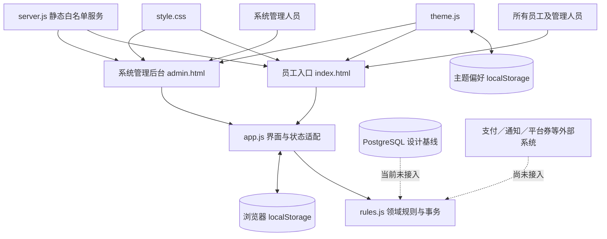

# 系统架构

本文件描述系统边界、模块依赖、数据流和状态所有权。文件定位与测试路线见 [MODULE_MAP](./MODULE_MAP.md)，当前进度见 [CURRENT_STAGE](./CURRENT_STAGE.md)。

## 系统边界

当前信任边界在浏览器内，适合演示，不构成生产安全边界。

## 组件职责

### 静态入口与服务

- `index.html` 和 `admin.html` 只声明不同入口身份，并加载相同的主题、样式和应用模块。员工入口承载日常营业，系统后台只承载当前已实现的身份与权限管理。
- `server.js` 负责白名单静态文件和无缓存响应，不保存业务状态、不执行认证，也不提供 API。
- 员工端与系统后台的入口分离是界面边界；真实授权仍需未来服务端实现。

### 商品目录与套餐

- `catalog.js` 负责最小商品、销售规格、套餐定义及目录查询 helper。`DEFAULT_CATALOG` 只用于首次初始化、旧状态迁移和恢复 DEMO 数据；初始化完成后，报价、增购、库存、换酒、存酒、赠酒、报表和后台维护都读取 `state.catalog`，不再长期维护第二份运行时商品主数据。
- 商品使用稳定 `id`（当前如 `bw`、`qd`），本阶段不增加重复的 `sku` 字段。商品以 `baseUnit` 作为库存基础单位，以 `saleOptions` 表达单支、半打、整打等销售规格及各自的基础数量和当前价格。库存只按基础单位扣减。
- 套餐属于房型／时段报价和组合权益，不是普通商品，也没有套餐级 `affectsInventory` 开关。套餐只能描述固定配品、赠饮数量和允许选择范围；开房时将客人最终选择写入订单 `resolvedComponents`，按实际商品的 `inventoryManaged` 和基础数量扣减库存。
- 房费仍由房型／时段套餐报价负责；代驾等自由收费仍是订单独立收费项目，不为统一形式伪装成库存商品。

### 界面与状态适配

- `app.js` 读取入口类型、加载与迁移浏览器状态、渲染页面和弹窗、收集表单并显示结果。`taskCenterPage` 在员工入口按具体业务审核权限组合待办，`systemManagementPage` 不组合营业审核。
- `app.js` 负责持久化成功后的新状态，但不应自行复制领域校验。
- 手写签名、图片凭证和提醒都属于本机演示数据，没有可靠附件存储或通知服务。

### 领域规则

- `rules.js` 持有房型、身份、权限、可见性和业务事务；商品目录的默认数据与查询由 `catalog.js` 负责，规则层通过状态中的 `catalog` 读取运行时目录。
- `transact` 以原状态为输入，先克隆并校验，再返回新状态；失败时调用方不应写回。
- 金额以整数分保存；操作键用于防止同一请求重复记账。
- 权限在规则层强制执行；UI 是否显示按钮只用于可用性，不是安全控制。
- 订单形成时保存商品名称、分类、基础单位、销售规格、销售数量、基础数量、成交单价和成交金额快照；赠酒保存 `referenceValueCents`，套餐开房保存套餐价格和赠饮参考值快照。历史报表只读这些快照，不重新读取当前目录价格。
- `businessReviewSections` 只根据各业务审核权限决定待办分区；`backend.view` 仅决定能否进入系统后台，两者互不推导。

### 主题与视觉

- `theme.js` 在样式表前执行，先恢复主题偏好，减少刷新时的错误底色闪烁。
- 自动主题使用设备实际时间；业务练习时间由领域状态维护，两者相互独立。
- `style.css` 同时服务店员端和后台端，并负责响应式房卡、弹窗、报表和底部导航。

### 数据库与历史导入

- `database/schema.sql` 和 `seed.sql` 是 PostgreSQL 16 的目标关系模型与主数据基线。
- `database/kdocs-import.md` 与 `database/templates/` 定义历史日报和支出的暂存、校验和映射策略。
- 当前静态运行时不会连接或修改 PostgreSQL。未来接入时，房态、订单、库存、支付、审核和幂等必须迁移到服务端事务。

## 数据流与事务边界

1. 页面从 `jbhh-demo-v1` 加载状态；无法解析时使用 `initialState()`，其中复制 `DEFAULT_CATALOG` 到 `state.catalog`。
2. `migrateDemoState` 合并目录结构、迁移旧订单字段和旧消耗品 ID；旧记录已有的成交金额优先保留，无法可靠恢复的历史价格、名称或赠酒参考值标为未知，不用迁移当天当前售价伪造。
3. 用户操作由 `app.js` 转换为事务动作和输入数据。
4. `commit` 调用 `rules.js` 的 `transact`；规则层校验权限、前置状态、金额和业务条件。
5. 事务成功后 `persist` 写回完整状态并重新渲染；异常时原状态保持不变。
6. 主题偏好使用独立键 `jbhh-appearance-v1`，不会随业务状态重置。

这是一份单浏览器完整状态快照，不具备服务器并发控制。不同标签、设备或来源地址之间没有可靠的一致性协议。

## 状态所有权

| 状态 | 当前所有者 | 说明 |
|---|---|---|
| 房间、订单、付款、挂账、预订 | `rules.js` 定义结构与变化，`app.js` 持久化 | 浏览器状态；非服务器账本 |
| 商品目录、销售规格、套餐当前配置 | `state.catalog` 由 `catalog.js` 定义与迁移，`rules.js` 修改，`app.js` 持久化 | 运行时唯一目录来源；`DEFAULT_CATALOG` 不是运行时第二份主数据 |
| 订单成交与赠酒价格快照 | `rules.js` 在订单形成／赠酒确认时写入，`app.js` 展示和报表读取 | 当前改价不影响历史金额；旧记录无法恢复时保留 `legacy`／未知 |
| 权限配置 | `rules.js` 默认值与校验，状态中的 `capabilities` 保存覆盖 | 模拟身份可切换，不是真实登录 |
| 库存、支出、采购、客诉、交班 | 领域事务和同一业务状态 | 图片与提醒也只保存在本机 |
| 主题偏好 | `theme.js` | 与业务状态和练习时间独立 |
| PostgreSQL 关系数据 | `database/` 设计文件 | 当前没有运行时所有者 |
| 历史导入原文 | 目标数据库的 `import_*` 暂存表 | 尚未执行实际导入 |

## 关键设计理由

- 业务规则与 DOM 渲染分离，使规则能用 Node 内置测试直接验证。
- 事务返回新状态并在成功后统一持久化，避免校验失败留下半张单。
- 目录主数据只有 `state.catalog` 一份运行时事实；默认目录只承担初始化、迁移和恢复演示数据，避免商品报价、库存和后台维护发生双重维护。
- 销售规格和库存基础单位分离，订单同时保存销售规格快照与基础数量快照，避免把“一打”的价格误当成“一支”的单价。
- 套餐定义与订单最终组成分离；套餐允许选择范围可以变化，但历史订单依赖已保存的 `resolvedComponents`，不重新解析当前套餐。
- 员工入口和系统后台共用领域代码，避免两套业务规则漂移；业务审核统一在员工入口调用原事务，不复制审核实现。
- 待办中心只聚合“现在等我处理”的事项和本人审核记录，员工补录、回款登记、库存盘点、采购与交班等主动操作仍归所属业务模块。
- 主题偏好独立存储，使恢复练习数据不会清除个人显示选择。
- 历史数据先保留原文再映射，避免汇总表和缺失字段被实现者猜测。

## 正式系统需要改变的边界

正式化时需要新增受信任的后端 API、真实认证、数据库 migration、服务端权限、审计、并发版本、支付回调、附件与通知。前端 `localStorage` 可以保留界面偏好或缓存，但不能继续拥有营业账本、权限决策或支付结果。
