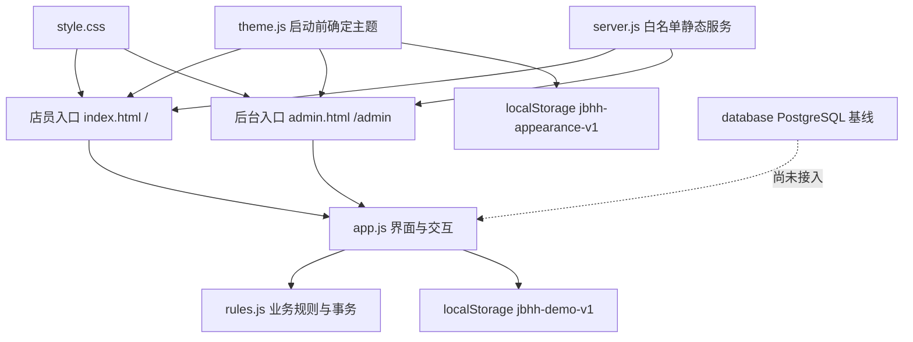

# 代码架构与数据模型

## 总体结构



## 运行文件职责

| 文件 | 职责 |
|---|---|
| `index.html` | 店员入口，设置 `data-app-entry="staff"`。 |
| `admin.html` | 后台入口，设置 `data-app-entry="admin"`。 |
| `server.js` | 监听 `0.0.0.0:4173`，只返回白名单静态文件；不提供 API。 |
| `app.js` | 加载／迁移本机状态、渲染所有页面和弹窗、处理表单、手写签名、持久化与提示。 |
| `rules.js` | 商品、房型、身份、权限、价格、库存和所有业务事务；失败时不回写原状态。 |
| `theme.js` | 在样式表前确定日间／夜间主题，处理自动边界、刷新和跨标签同步。 |
| `style.css` | 日间和黑金夜间视觉、响应式房卡、弹窗、报表和底部导航。 |

## 业务调用链

1. `app.js` 从 `localStorage` 读取 `jbhh-demo-v1`，失败则使用 `initialState()`。
2. `migrateDemoState()` 兼容历史演示状态并补充新字段。
3. 界面事件把表单转换为事务参数。
4. `commit()` 调用 `rules.js` 的 `transact(state, action, data, key)`。
5. `transact` 深克隆状态、校验身份／具体权限、执行业务规则，并用操作编号防重复提交。
6. 事务成功后 `persist()` 才写回 `localStorage` 并重新渲染；抛错时原状态保持不变。

所有金额在规则层以整数分保存，界面显示时再格式化成人民币。

## 应用入口分离

`APP_ENTRY` 从 `document.body.dataset.appEntry` 读取：

- `staff` 默认页面为 `rooms`，导航为房间、存取酒、按权限显示的报表、我的。
- `admin` 默认页面为 `manage`，导航为管理和按权限显示的报表。
- 店员入口只有拥有 `backend.view` 时才显示“后台管理”链接。
- 后台入口缺少 `backend.view` 时显示无权限页面，不渲染管理功能。
- 两个入口共享 `app.js` 和同一个来源下的 `localStorage`，因此状态一致。

## 权限模型

- `PERMISSION_DEFINITIONS` 定义具体权限、分组和岗位默认值。
- `defaultCapabilities()` 生成每个演示身份的默认具体权限。
- `effectiveUser(state, userId)` 合并身份说明、角色和本机自定义权限。
- `need()` 是事务入口的强制权限校验；界面隐藏按钮只是可用性提示，不能代替规则校验。
- `review.self` 只解决“审核人等于提交人”的附加条件，不能代替房间恢复、回款、库存等业务审核权限。
- 管理员固定拥有全部权限，其他身份的修改保存在 `state.capabilities`。

## 核心状态

`initialState()` 主要字段：

| 字段 | 内容 |
|---|---|
| `clock` | 手动练习时间。 |
| `user` | 当前演示身份 ID。 |
| `capabilities` | 各身份的具体权限。 |
| `rooms` | 房号、房型、房态、当前订单和异常信息。 |
| `orders` | 开房账单、增购、赠送、换酒、付款、挂账与审核。 |
| `reservations` | 未来日期、场次、来源、登记人和状态。 |
| `deposits` / `withdrawals` | 存酒批次与取酒流水。 |
| `inventory` / `consumables` | 酒水与消耗品库存状态。 |
| `inventoryReviews` | 期初建账和盘点审核。 |
| `expenses` / `procurements` | 支出、报销及采购关联。 |
| `incidents` | 客诉／异常及处理恢复审核。 |
| `roomIssueReviews` | 房态异常记录和恢复申请。 |
| `handovers` | 交班实收、实点和前台现金。 |
| `processed` | 已处理操作编号，防止重复提交。 |

## 审核数据约定

六类审核申请至少记录：

- 提交人 ID／名称与提交时间；
- 审核状态；
- 审核人、审核时间、审核备注；
- `selfReviewAuthorized`：只有审核人和提交人相同且拥有 `review.self` 时为 `true`。

旧状态在 `migrateDemoState()` 中补齐字段，当前能力模型版本为 3。

## PostgreSQL 基线

`database/schema.sql` 当前定义 43 张表和 14 个索引，主要关系如下：

```text
stores
├─ employees ─ employee_roles / employee_permissions / role_permissions
├─ rooms ─ room_issues / room_issue_change_requests / reservations
│       └─ room_orders
│          ├─ order_items / order_exchanges / gift_requests
│          ├─ payments / rounding_reviews
│          ├─ credits ─ credit_repayment_requests / credit_repayments
│          └─ platform_vouchers
├─ products ─ inventory_balances / inventory_movements / inventory_count_requests
├─ stored_wine_lots ─ stored_wine_withdrawals
├─ expense_records ─ procurement_records
├─ incidents ─ incident_resolution_requests
├─ handovers / idempotency_keys / audit_events
└─ import_batches ─ 日报与支出暂存、错误和正式记录映射
```

数据库文件目前是设计和导入基线。`server.js` 不连接 PostgreSQL，页面也不会执行 SQL。

## 测试结构

| 文件 | 当前数量 | 覆盖 |
|---|---:|---|
| `rules.test.js` | 48 | 业务规则、权限、事务回滚与幂等。 |
| `theme.test.js` | 4 | 自动／手动主题、刷新、跨标签和异常存储。 |
| `database.test.js` | 5 | 关系表、约束、种子和导入模板契约。 |
| `entry.test.js` | 1 | 店员／后台独立入口与静态路由。 |
